<html lang="en">
<head>
<meta charset="UTF-8" />
<meta name="viewport" content="width=device-width, initial-scale=1.0" />
<title>Portfolio Peppi myllymäki</title>
<link rel="stylesheet" href="workportfolio.css"/>
</head>
<body>
<header class="site-header">
<h1>Peppi Myllymäki</h1>
<nav>
<a href="#about">About me</a>
<a href="#websites">Web development work</a>
<a href="#work">Other work experience</a>
<a href="#projects">Projects & skills</a>
<a href="#education">Education</a>
<a href="#contact">Contact</a>
</nav>
</header>

<main>
<!-- About Section -->
<section id="about" class="section">
<h2>About Me</h2>

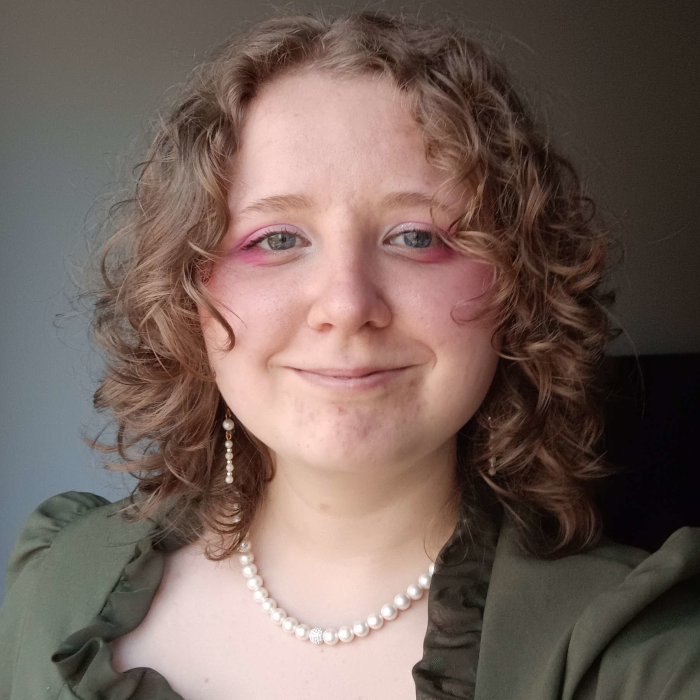 </img>

I'm a game programming engineering student finishing my degree. I combine my 
technical coding skill with strong visual and creative capabilities.
I enjoy building things that sit between storytelling, design and technology; 
from websites to 3D visuals, interactive experiences and videogames.
  
I work with C#, C++, Unity, Unreal Engine, HTML, CSS and JavaScript, 
and I’ve created several websites both with and without frameworks. 
I also have experience in 3D modeling, animation, photogrammetry, Blender, 
XAMPP, and graphic design. Lately I’ve been expanding my skills in working with data, 
Excel and basic data processing workflows.
  
My working style is calm, responsible and thorough. I’m comfortable taking initiative, 
guiding a team when needed, and learning new tools quickly. I’m especially motivated 
by projects where I can merge code, visual storytelling and interactive design.
  
I’m looking for a role where I can create impactful digital experiences; whether 
through data-driven visuals, interactive stories, game-like experiences, or new experimental 
formats that mix design and code.

</section>

<section id="websites" class="section">
<h2>Web development work</h2>

<button class="accordion-header">XAMK Gamelab | Website developer ⌵</button>

I developed the Gamelab website, following designs created in Figma by the project lead. My goal was to build 
a modern, visually appealing, and responsive site while implementing features like downloadable assets, 
interactive media galleries, and dynamic buttons.

     
<b>What I did</b>
  
<ul class="accordion-list">
<li>Developed the entire website using HTML, CSS, and JavaScript, implementing responsive layouts and animations.</li>
<li>Worked closely with the designer to iterate on layouts, ensuring the website reflected the brand and mascot concept accurately.</li>
<li>Implemented interactive features, including media galleries with "show more" and "show all" functionality, downloadable assets, 
and dynamic buttons.</li>
<li>Managed folder structure, CSS, and JavaScript for maintainability, troubleshooting complex layout and interaction issues.</li>
<li>Tested and refined responsiveness across devices and browsers for a polished user experience.</li>
<li>Documented issues and requested feedback via a collaborative document to streamline development and ensure accuracy.</li>
<li>Took initiative in coming up with ideas for improving the website both in it's interactivity and content.</li>
</ul>

  
<b>Result</b>
 
A fully functional, visually cohesive, and interactive website that supports the Gamelab brand. The project strengthened 
my skills in web development, problem-solving, and collaborative design implementation. Over many months, I built multiple pages, 
solved technical challenges, and polished the website to completion.
  
Currently the first version is up, and the second and final rendition is waiting for approval from management. The second rendition has many new pages, 
features and polish.

<a href="https://gamelab.fi/" target="_blank" class="accordion-button">
Visit the website →
</a>

<button class="accordion-header">SAK:n Lohjan paikallisjärjestö | Website developer & Graphic design ⌵ </button>

I am designing and developing a modern and visually appealing website for SAK Lohja using the Yhdistysavain tool, following the client’s 
specifications. The project focuses on improving accessibility, streamlining workflows by implementing online forms, and creating a cohesive 
brand identity, including designing a new logo. The goal is to deliver a professional, user-friendly site that reflects the client’s values 
and enhances their digital presence.

    
<b>What I did</b>
<ul class="accordion-list">
<li>Redesigned the website layout to modernize the visual style while aligning with the client’s branding.</li>
<li>Implemented accessibility standards to make the website usable for all visitors.</li>
<li>Added interactive forms to replace outdated paperwork workflows.</li>
<li>Designed a logo and visual elements to strengthen the brand identity.</li>
<li>Worked iteratively with client feedback to refine visuals, functionality, and overall user experience.</li>
</ul>

  
<b>Result</b>
  
This is an ongoing project aimed at producing a visually engaging, accessible, and efficient website that enhances the client’s 
brand and user experience. The website is scheduled for completion by the end of the year (2025).
  

<button class="accordion-header">Lavoka Oy | Website developer ⌵ </button>

I designed and developed the official website for Lavoka Oy using Zoner’s website builder, creating a professional 
and user-friendly site based on the company’s branding and content. Working independently, I handled the full 
process from concept to launch, including visual design, layout planning and implementing all core features.

  
  
<b>What I did</b>
  
<ul class="accordion-list">
<li>Designed the entire site layout and visual identity using the company’s original website as a reference for color scheme and content.</li>
<li>Integrated company-provided photos, added animations, and structured multimedia for a more engaging user experience.</li>
<li>Implemented interactive features such as a Google Maps embed and a fully functional contact form, including necessary configurations.</li>
<li>Ensured full responsiveness across desktop, tablet and mobile through extensive testing and refinements.</li>
<li>Handled multiple rounds of client revisions with clear communication and quick adjustments.</li>
<li>Performed all post-launch fixes, updates and content additions to ensure long-term reliability.</li>
</ul>

  
<b>Result</b>
  
A polished, responsive and visually cohesive website that aligned with the company’s needs and exceeded 
client expectations. The project demonstrated my ability to independently manage a full web development pipeline; from 
design and UX decisions to technical implementation and client collaboration.
  

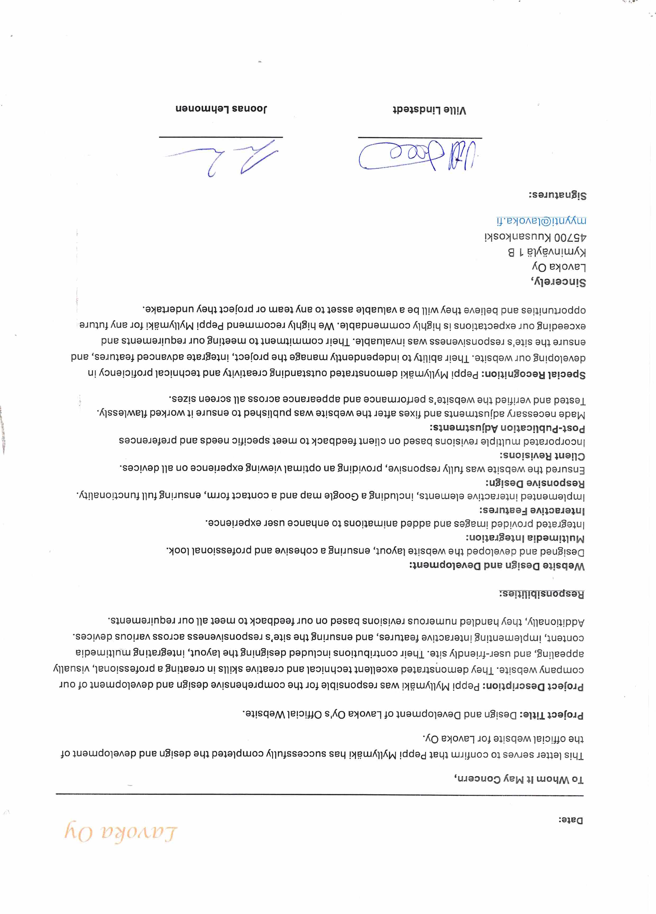 </img>

<a href="https://lavoka.fi" target="_blank" class="accordion-button">
Visit the website →
</a>

<button class="accordion-header">Own website ⌵ </button>

This was the first website I ever created, built in 2023 during a web development course. 
It served as my personal portfolio and became the project that ignited my passion for designing and 
coding websites. The site is fully made with pure HTML and CSS, focusing on expressive visuals, 
original artwork, and a clear presentation of who I was at the time.

    
<b>What I did</b>
<ul class="accordion-list">
<li>Designed and built a complete personal portfolio using only HTML and CSS.</li>
<li>Created several original illustrations and decorative graphics to give the site a unique artistic identity.</li>
<li>Structured content to introduce my skills, personality, and early projects in an accessible and visually appealing way.</li>
<li>Experimented with layouts, color palettes, and styling techniques that shaped the foundations of my current web design style.</li>
<li>Learned the core principles of web structure, responsive design basics, and clean CSS organization.</li>
</ul>

  
<b>Result</b>
  
A creative and personal portfolio website that marked the beginning of my interest in front-end development. 
While some information is now outdated, the project remains important to me as the first step in my journey 
toward more professional and polished web design work.
  

<a href="https://portfolio.gamelab.fi/peppi.myllymaki/" target="_blank" class="accordion-button">
Visit the website →
</a>

</section>

<section id="projects" class="section">
<h2>Projects and skills</h2>

<section class="section skills-overview" id="skills-overview">
<h3>Key skills demonstrated across projects and  gained from courses</h3>

<ul class="skills-list">

<li class="skill">
Excel
    Excel: Managing and Analyzing Data
</li>

<li class="skill">
Graphic design & Illustration
    Ylioppilaskunnan Soittajat   Luna Raccoon's Rescue   Own website
</li>

<li class="skill">
Animation & motion
  <br >Animation   Luna Raccoon’s Rescue
</li>

<li class="skill">
Accessibility
    Web accessibility certificate  
</li>

<li class="skill">
Front-end (HTML / CSS / JS)
    XAMK Gamelab   Own website   
Website basics
</li>

<li class="skill">
Full-stack / CRUD & backend fundamentals
    Task manager   
Backend programming   Game data
</li>

<li class="skill">
3D modelling & photogrammetry
    3D-modeling   Photogrammetry   
Graphics and 3D-modeling    Character design
</li>

<li class="skill">
Web design
    Lavoka oy    SAK:n Lohjan paikallisjärjestö    Own website   
Website basics
</li>

<li class="skill">
Testing
    XAMK Gamelab    Lavoka oy    SAK:n Lohjan paikallisjärjestö    Own website   
Quality assurance in game production   Game testing and test design
</li>

<li class="skill">
Programming
    Kuura Murder Mystery 3   
Programming    Game programming (+ Applied, Advanced)    Object oriented programming    Software architecture and game programming patterns    Backend programming    Operating environments of online games
</li>
</ul>
</section>

<button class="accordion-header">Excel: Managing and Analyzing Data | Certificate ⌵ </button>

 </img>

<button class="accordion-header">3D-modeling ⌵ </button>

<!-- Add images for this group -->
<!--  -->
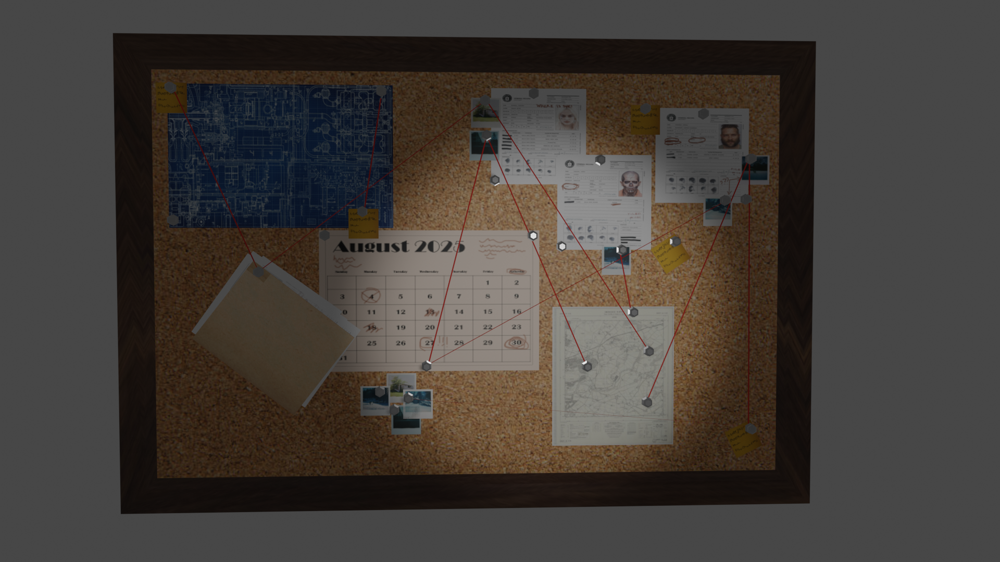</img>
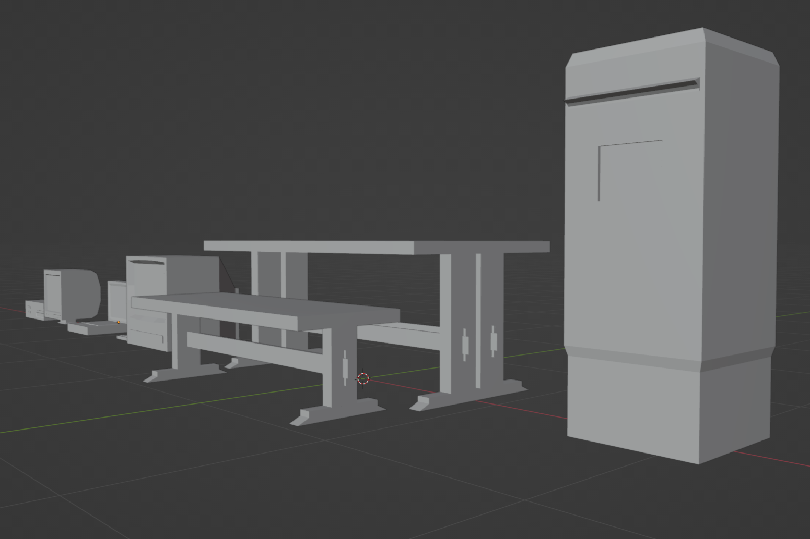</img>
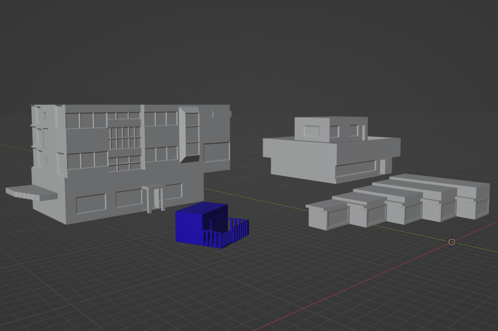</img>
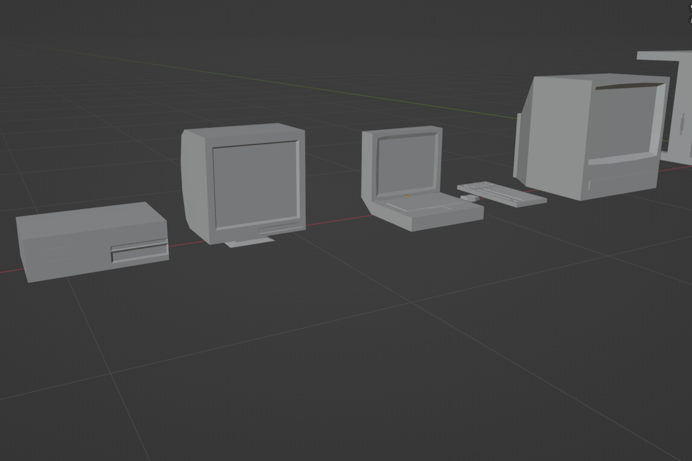</img>
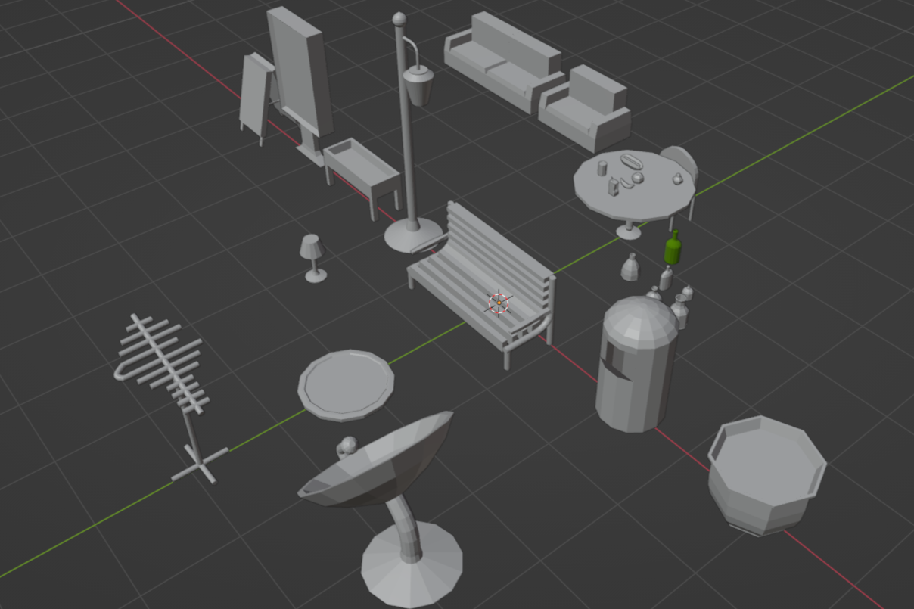</img>
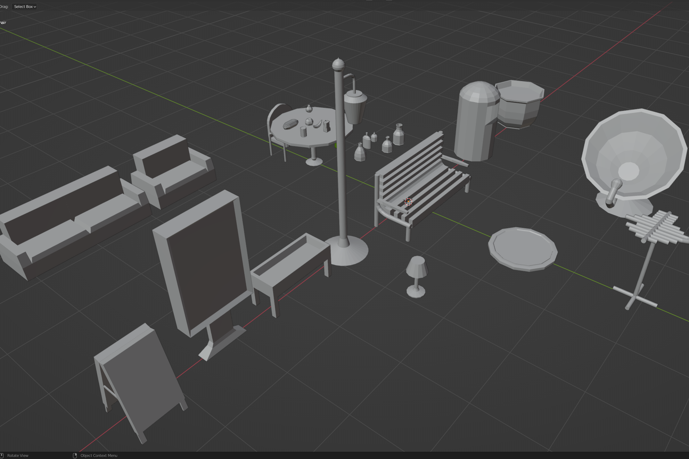</img>
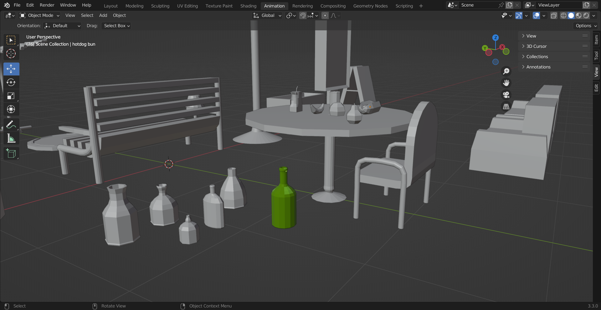</img>

<button class="accordion-header">Animation ⌵ </button>

<iframe width="560" height="315" src="https://www.youtube.com/embed/hyzAjb1x4rk?si=HcT0N_pSQuiUr6kG" 
title="YouTube video player" frameborder="0" allow="accelerometer; autoplay; clipboard-write; 
encrypted-media; gyroscope; picture-in-picture; web-share" referrerpolicy="strict-origin-when-cross-origin" 
allowfullscreen></iframe>
  

<iframe width="560" height="315" src="https://www.youtube.com/embed/3t7M_1VFqgU?si=TK05yoSTWV0Datqx" 
title="YouTube video player" frameborder="0" allow="accelerometer; autoplay; clipboard-write; encrypted-media; 
gyroscope; picture-in-picture; web-share" referrerpolicy="strict-origin-when-cross-origin" allowfullscreen></iframe>

<button class="accordion-header">Photogrammetry ⌵ </button>

As part of the “Future of Game Technologies” course, I acted as the photogrammer for our project. I explored various photogrammetry tools such as RealityScan and Meshroom, learning their workflows, limitations, and requirements. While many attempts resulted in unsuccessful models, I successfully integrated a functional 3D model into our project, gaining hands-on experience with the full photogrammetry pipeline.

    
<b>What I did</b>
<ul class="accordion-list">
<li>Experimented with multiple photogrammetry tools to capture and process real-world objects into 3D models.</li>
<li>Learned about lighting, angles, and processing requirements for successful model generation.</li>
<li>Integrated a final successful 3D model into the project’s environment.</li>
<li>Analyzed failures to improve techniques and understanding of photogrammetry workflows.</li>
</ul>

  
<b>Result</b>
  
Gained practical experience with photogrammetry, successfully contributing a usable 3D model to the project, and developed a strong foundation to explore more advanced photogrammetry techniques in the future.
  

<iframe width="560" height="315" src="https://www.youtube.com/embed/XZELHYaPTKU?si=W39tDsbFrNymwelo" title="YouTube video player" frameborder="0" allow="accelerometer; autoplay; clipboard-write; encrypted-media; gyroscope; picture-in-picture; web-share" referrerpolicy="strict-origin-when-cross-origin" allowfullscreen></iframe>
<a href="https://sketchfab.com/eijesseauta" target="_blank" class="accordion-button">
See a few other photogrammetry tests →
</a>

<button class="accordion-header">Web accessibility | Certificate ⌵ </button>

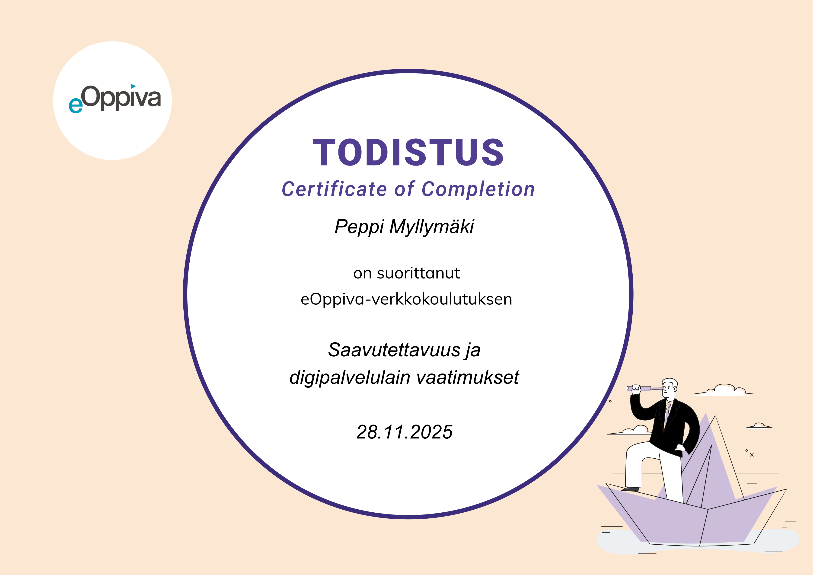</img>

<button class="accordion-header">Task manager⌵ </button>

This Task Manager project is a full-stack application I developed to practice backend functionalities and user management features. It allows users to                     create, read, update, and delete tasks, with role-based privileges (user, moderator, admin) and session-based authentication. The app demonstrates                           CRUD operations, multiple HTTP methods, and role-specific UI.

    
<b>What I did</b>
<ul class="accordion-list">
<li>Designed and implemented a scalable backend using Node.js and Express to manage tasks and users.</li>
<li>Implemented role-based access control: users can manage their own tasks, moderators can view all tasks, and admins can delete any task.</li>
<li>Created secure login and registration with hashed passwords and session management for authorization.</li>
<li>Developed task functionalities with full CRUD operations (Create, Read, Update, Delete) and different views for completed, pending, and all                             tasks.</li>
<li>Implemented frontend feedback, including color changes and messages when tasks are completed.</li>
<li>Designed admin and moderator panels to clearly differentiate privileges and visibility of tasks.</li>
<li>Integrated client-side features with backend API to demonstrate full-stack application workflow.</li>
</ul>

  
<b>Result</b>
  
A fully functional task management system showcasing full-stack development skills, including secure user authentication, role-based access control, and responsive UI features. This project demonstrates my ability to independently design and implement backend and frontend systems while applying proper web development practices.
  

<a href="https://www.youtube.com/watch?v=UjFrSwI6JS8" target="_blank" class="accordion-button">
Watch demo video →
</a>

<!-- Add screenshots of login, task lists, admin/moderator views -->

<button class="accordion-header">GAMEJAM Videogame "White house of Helsinki" ⌵ </button>

The White House of Helsinki is a humorous puzzle game created during the 2023 Global Game Jam with the theme "Roots". Players control a spider-cat-alien to uncover secrets from people’s minds. The game uses a limited color scheme of blue, baby pink, and greyscale for a unique visual style.

    
<b>Team & Roles</b>
<ul class="accordion-list">
<li><b>Me:</b> Lead 2D Artist, Lead Writer, Researcher</li>
<li><b>Minjutin:</b> Producer, Programmer, Technical Artist</li>
<li><b>Randomlollis:</b> 3D Modeler, Writer, Composer, Environment & Character Designer, 2D Artist</li>
</ul>

  
<b>What I did</b>
<ul class="accordion-list">
<li>Researched and wrote humorous in-game secrets, ensuring content was safe and entertaining for players.</li>
<li>Created all primary 2D game art, including puzzle visuals and promotional images (e.g., Twitter image).</li>
<li>Generated usernames and other small interactive text elements for gameplay clarity and immersion.</li>
<li>Collaborated closely with others to maintain a cohesive visual and narrative experience.</li>
<li>Ensured art and story complemented the game’s quirky and humorous tone while staying within the limited color scheme.</li>
</ul>

  
<b>Result</b>
  
A functioning, humorous puzzle game that met all project goals within the jam timeframe. Players experience a fun, unique, 
and safe gameplay environment, with a strong visual identity and cohesive art style. The project highlights my ability to 
combine research, writing, and 2D art in a collaborative game development setting.
  

<a href="https://minjutin.itch.io/the-white-house-of-helsinki" target="_blank" class="accordion-button">
Play the game →
</a>

<!-- Add images or video for this project -->

<button class="accordion-header">Luna Raccoon’s Rescue | Mobile Game ⌵ </button>

Luna Raccoon’s Rescue is a virtual pet mobile game created during the “Ecosystem of Games” course. 
Inspired by classic virtual pet mechanics, the game lets players feed, wash and care for Luna the raccoon. Our team developed 
the project with a limited timeframe, focusing on core interactions and essential gameplay features.

    
<b>Team & Roles</b>
<ul class="accordion-list">
<li><b>Me:</b> Creative Director, 2D Artist, Storywriter, Marketing & Advertising</li>
<li><b>Jocke Nylund:</b> Lead Programmer</li>
<li><b>Emil Ahvenainen:</b> UI Programmer</li>
<li><b>Nicolas Lindell:</b> Music Composer</li>
</ul>

  
<b>What I did</b>
<ul class="accordion-list">
<li>Wrote the game’s narrative and created the full story concept for the project.</li>
<li>Designed and illustrated all 2D game assets in Procreate, including character states, consumables, UI icons, backgrounds and the app icon.</li>
<li>Created the animated intro video shown on first launch to introduce the game’s backstory.</li>
<li>Produced all marketing and advertising materials for the game and fictional studio brand using Procreate and Canva.</li>
<li>Contributed to the overall creative direction, visual style and player experience.</li>
</ul>

  
<b>Result</b>
  
A charming virtual pet mobile experience centered around Luna the raccoon, featuring hand-drawn art, a 
narrative intro animation and cohesive marketing materials. While the game still needs polish, the project 
demonstrates my strengths in art direction, storytelling and visual asset production for games.
  

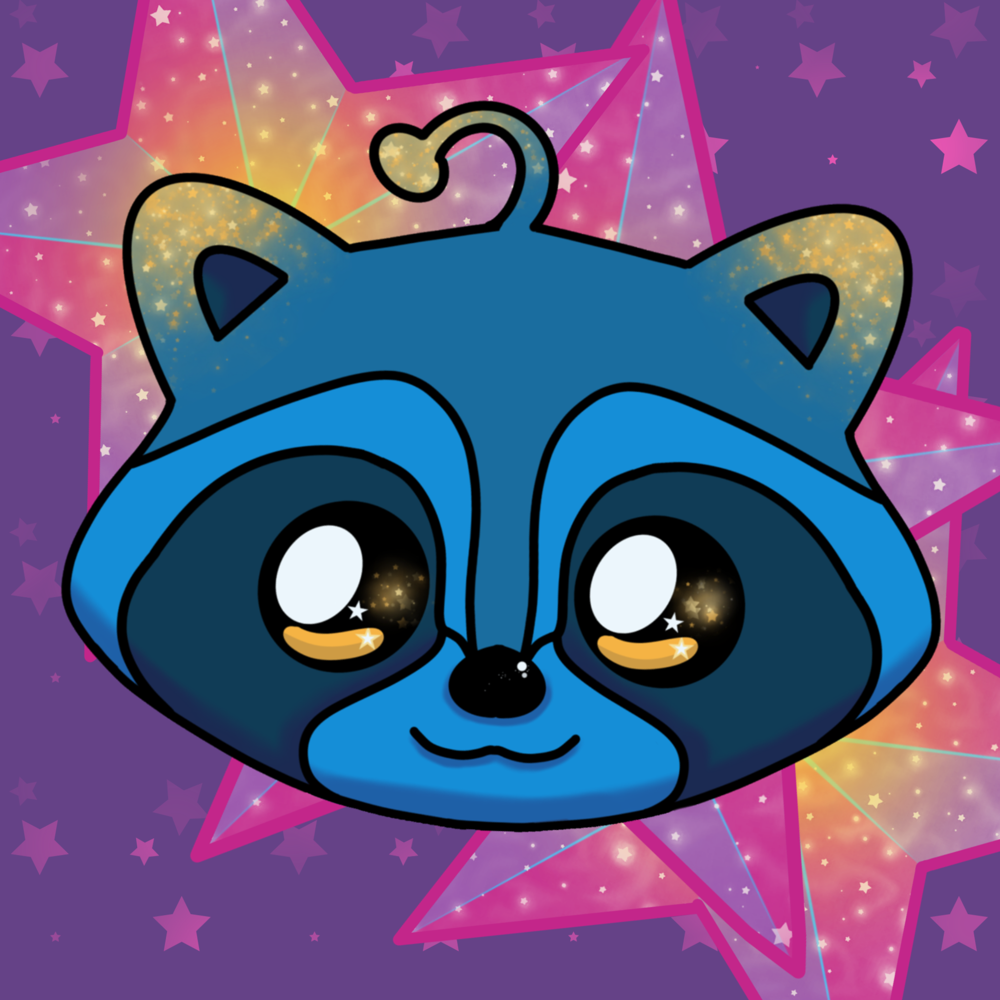</img>
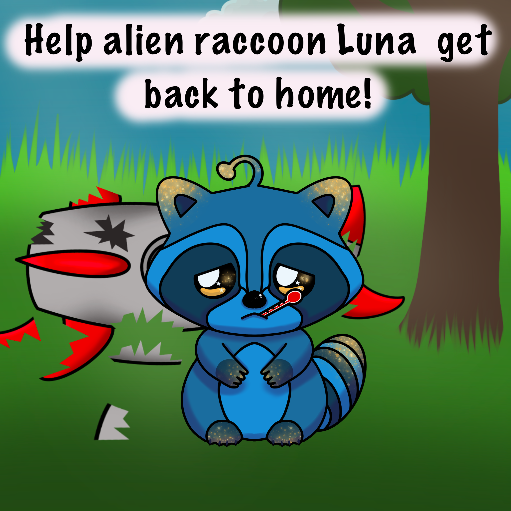</img>
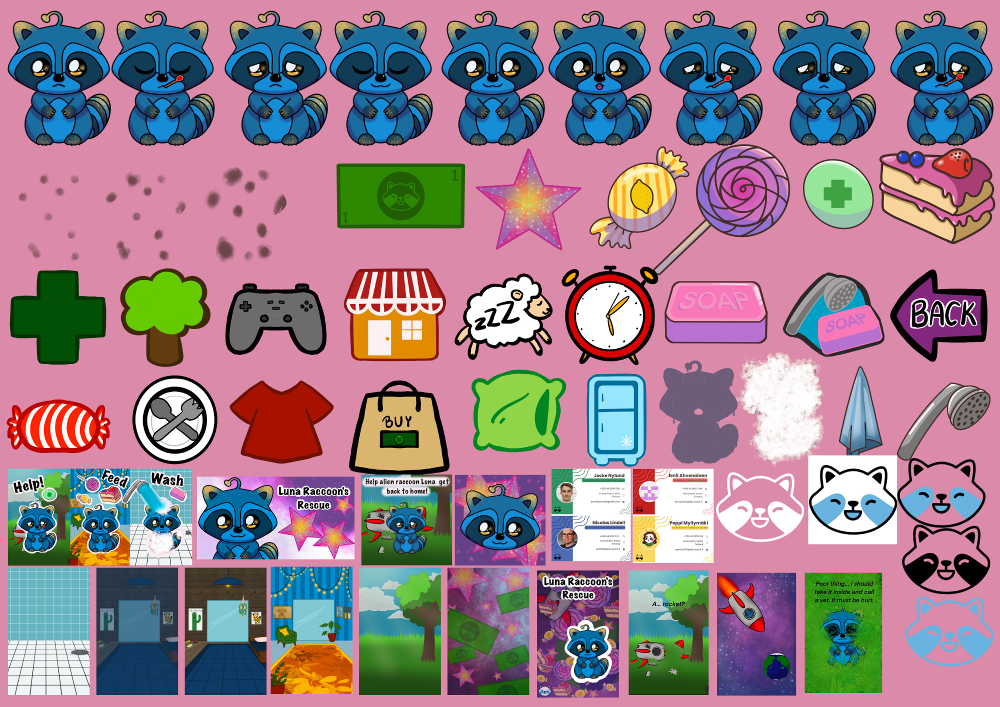</img>
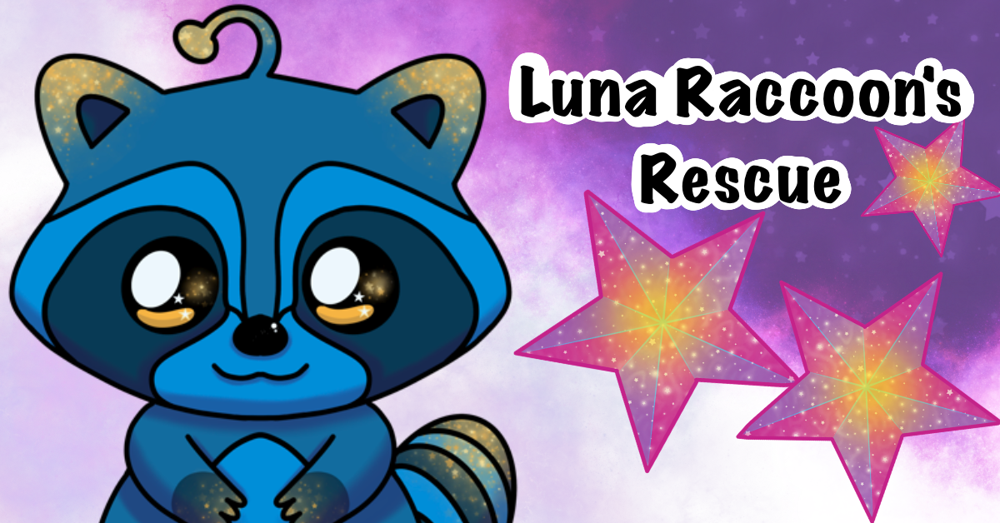</img>
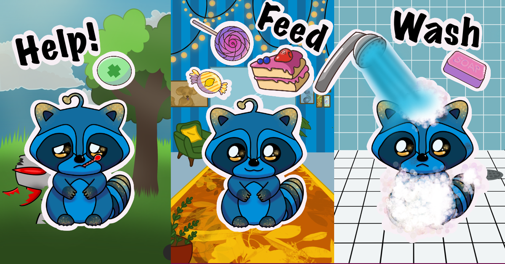</img>
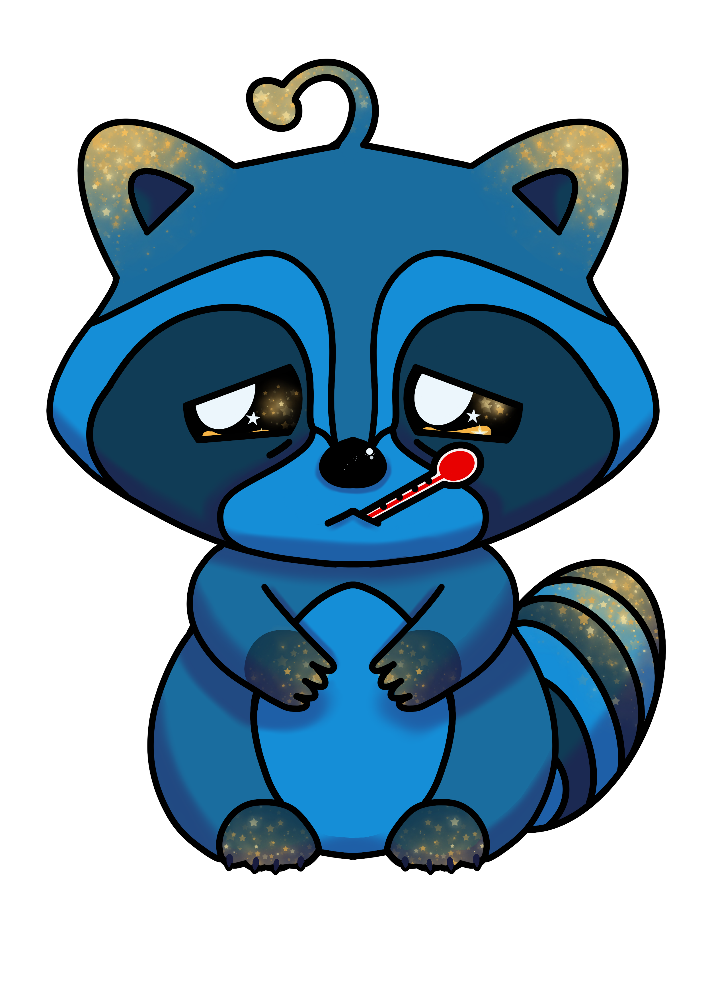</img>

<a href="https://youtu.be/OaWkAXYpFdI?si=pm7I5pZXTolPVBcg" target="_blank" class="accordion-button">
Demo video →
</a>

<button class="accordion-header">GAMEJAM Videogame "Kuura Murder Mystery 3" ⌵ </button>

Kuura Murder Mystery is a visual novel murder mystery created during the Kuura Game Jam (18–20 July 2025). 
The game was built as part of the annual jam tradition, and this was my first time participating as part of a three-person team. 
I handled all programming to make the game functional, allowing the designers and writers to focus on art and story.
  
<b>Team & Roles</b>
<ul class="accordion-list">
<li><b>Me:</b> Programmer</li>
<li><b>Minjutin:</b> Designer, artist, co-writer</li>
<li><b>Mooltidude:</b> Designer, writer, co-artist</li>
</ul>
    
<b>What I did</b>
  
<ul class="accordion-list">
<li>Set up the Unity 2D structure and UI flow for the game, including main menu, credits, and gameplay screens.</li>
<li>Built a script-based dialogue system to automatically display character names, dialogue lines, positions, backgrounds, and sprites.</li>
<li>Implemented scene handling, character loading, and a dynamic UI manager to update visuals based on the script data.</li>
<li>Adapted and customized existing DialogueManager and DialogueParser scripts to fit the project, troubleshooting Unity 2D quirks along the way.</li>
</ul>

  
<b>Result</b>
  
A fully functional visual novel game featuring an automated dialogue system and polished UI. The project demonstrates my ability to implement 
complex systems in Unity 2D, problem-solve independently, and collaborate effectively with designers and writers in a short development timeframe.
  

<!-- Add images or video for this project -->

<a href="https://mooltidude.itch.io/kuura-murder-mystery-3-endgame" target="_blank" class="accordion-button">
Play the game →
</a>

</section>

<!-- Work Section -->
<section id="work" class="section">
<h2>Other work experience</h2>

<button class="accordion-header">Ylioppilaskunnan Soittajat | Graphic Design ⌵ </button>

I designed and produced a full set of marketing materials for a concert event, including a poster, social media advertisement,
brochure, and banner. The visuals were created using Procreate for artistic illustration work and finalized in Canva for layout, 
typography, and export. The materials strengthened the event’s brand identity and improved visibility across both digital and print channels.

    
<b>What I did</b>
  
<ul class="accordion-list">
<li>Created custom illustrations and visual elements in Procreate to establish a cohesive artistic style.</li>
<li>Designed event posters, brochures and banners with consistent branding and visual hierarchy.</li>
<li>Optimized layouts in Canva for both print and social media formats.</li>
<li>Developed materials that effectively supported marketing goals in both digital and physical advertising.</li>
<li>Ensured all assets followed event branding and maintained clarity, readability and visual appeal.</li>
</ul>

  
<b>Result</b>
  
A unified marketing package that enhanced the concert’s branding and increased visibility across social media and 
printed advertising. The project highlights my ability to combine illustration, graphic design and layout 
skills to create professional promotional materials.
  

</img>
</img>
</img>
</img>
</img>

<button class="accordion-header">Customer service work ⌵ </button>

<b>K-Market Hovinsaari — Sales Associate (May 2024 – May 2025)</b>  
Provided customer service, operated the cash register, restocked products, and maintained a tidy sales floor. Strengthened communication skills and efficiency in a fast-paced retail environment.
    

<b>Joblink Oy — Industrial Shelver (May 2024 – Jul 2024)</b>  
Managed early-morning deliveries, shelf stocking, product facing, and expiration checks at K-Citymarket. Improved attention to detail and time management.
    

<b>Eezy — Sales Associate (Jul 27–29, 2023)</b>  
Sold drinks and handled restocking at Kotkan Meripäivät festival. Maintained the VIP area and worked effectively in a high-pressure event setting.
    

<b>Eezy Extraajat — Cashier (Jun 2023 – Oct 2023)</b>  
Operated traditional and self-checkout registers at K-Citymarket. Ensured smooth transactions and kept the checkout area clean and organized.
    

<b>Wihuri Metro-tukku — Cashier & Warehouse Worker (Dec 2021 – Aug 2022)</b>  
Worked across cashier duties, order picking, unloading shipments, receiving phone orders, and assisting customers. Developed strong logistics and organizational skills across varying shift hours.
    

<b>Wihuri Metro-tukku — Cashier (Jun 2020 – Aug 2020)</b>  
Handled cashier tasks, shelf maintenance, inventory checks, and storage of regulated products. Ensured accuracy, compliance, and product availability.
    

<b>Tynninharjun Autogrilli — Sales Associate (Aug 2018 – Aug 2021)</b>  
Took on a versatile role including cooking, sales, cleaning, inventory, and kiosk operations. Gained strong multitasking skills and increasing responsibility over the years.
    

</section>

<!-- Studies Section with Accordion -->
<section id="education" class="section">
<h2>Education</h2>

I am completing (and soon graduating from) a Bachelor of Engineering (AMK) in Game Programming at Kaakkois-Suomen 
ammattikorkeakoulu (XAMK), with a strong academic record (GPA 4.24). My studies have given me a broad foundation 
across multiple areas of game development, including programming (C#, C++), game engine workflows (Unity, Unreal), 
3D modeling and animation, graphics, web development (HTML, CSS, JS), game design, physics and mathematics for games, 
data management, and digital security.
    
My studies have provided me with a wide-ranging toolkit to approach both technical and creative challenges in game and 
interactive media development, as well as in broader digital projects.

</section>

<!-- Contact Section -->
<section id="contact" class="section">
<h2>Contact</h2>

📧 peppitau@gmail.com

<a href="https://www.linkedin.com/in/peppi-myllym%C3%A4ki-589670253/" target="_blank">👤 LinkedIn</a>

</section>
</main>

<!-- Modal for viewing images/videos -->

&times;

</body>
</html>
